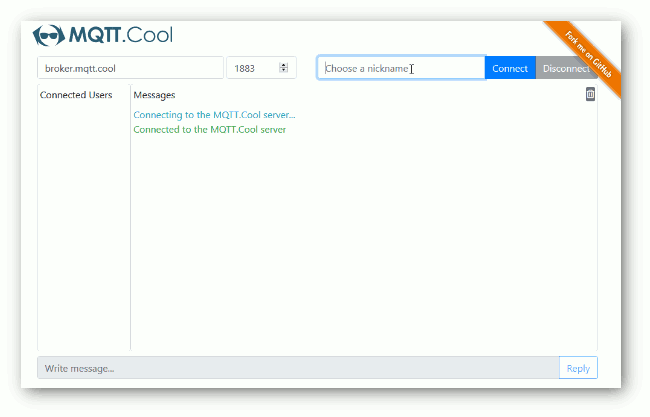
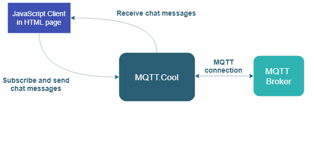

# Chat Demo - HTML Client

The **Chat Demo** is a very simple chat application based on MQTT.Cool.

## Live Demo

[](https://demos.mqtt.cool/chat)

### [ View live demo](https://demos.mqtt.cool/chat)


## Details

The **Chat Demo** implements an extremely simple chat application, which
shows a basic usage of the
*[MQTT.Cool Web Client API](https://mqtt.cool/docs/web-client-sdk/api/index.html)*
to handle communications with MQTT.Cool. All the users connected to the page can
exchange messages, therefore launch multiple instances of the demo, possibly on
different machines, to appreciate the message broadcast capability.

Check out the sources for further explanations.

### Overall Architecture

Here the overall architecture of the demo:



## Install

If you want to install a version of this demo pointing to your local MQTT.Cool,
follows these steps.

* As prerequisite, this demo needs an up and running MQTT broker. You can choose
whatever MQTT broker you prefer, or may also use one of the available public
broker (an up-to-date list is maintained at
https://github.com/mqtt/mqtt.github.io/wiki/public_brokers).
* Launch the MQTT.Cool server.
* Download this project.
* As the latest version of the MQTT.Cool JavaScript library is always available
through [`unpkg`](https://unpkg.com/#/), it is hot-linked in the html page.

## Configure

The demo assumes that the MQTT.Cool server is launched from localhost, but if
you need to target a different server, search in `src/app.js` this
line:

```js
const MQTT_COOL_URL = 'http://localhost:8080';
```

and change it accordingly.

## Launch

Open your browser and point it to
[http://localhost:8080/ChatDemo](http://localhost:8080/ChatDemo), or to the
address according to the host and/or the name of the folder where you deployed
the project.

The demo is configured to establish an *MQTT channel* to the publicly accessible
MQTT broker hosted at `tcp://broker.mqtt.com:1883`, but fill free to provide
any broker address through the relative form fields; then, click *Connect* to
start.

## See Also

* [Check out all other demos on MQTT.Cool site](https://mqtt.cool/demos)

## MQTT.Cool Compatibility Notes

* Compatible with MQTT.Cool SDK for Web Clients version 1.0.0 or newer.
* Compatible with MQTT.Cool since version 1.0.3 b1 or newer.

