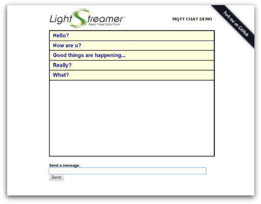

# MQTT.cool - Basic Chat Demo - HTML Client

The **MQTT Basic Chat Demo** is a very simple chat application based on
MQTT.cool.



## Details

The **MQTT Basic Chat Demo** implements an extremely simple chat application,
which shows a basic usage of the *MQTT.cool Web Client API* to handle
communications with MQTT.cool. All the users connected to the page can exchange
messages, therefore launch multiple instances of the demo, possibly on different
machines, to appreciate the message broadcast capability.

Check out the sources for further explanations.

## Install

If you want to install a version of this demo pointing to your local MQTT.cool,
follows these steps.

* As prerequisite, this demo needs a MQTT infrastructure to run. You can choose
whatever MQTT broker you prefer, or may also use one of the available public
broker (an update-to-date list is maintained at
[https://github.com/mqtt/mqtt.github.io/wiki/public_brokers]()).
* Configure the MQTT.cool instance. Please refer to Lightstreamer
web site [download page](http://download.lightstreamer.com/) to find the
MQTT.cool download package. MQTT.cool comes with a set of predefined
configurations for connecting with local MQTT server instances, as well as with
the most common publicly accessible brokers. If you want to provide a new custom
configuration, open the `mqtt_master_connector_conf.xml` file located under
`<MQTT.COOL_HOME>/mqtt_connectors` and provide a set of entries similar to
the following (please refer to the inline documentation for more in-depth
information on how to configure broker connection parameters):

  ```xml
  ...
  <!-- MQTT broker connection parameters for a local instance
       listening on port 1883, aliased by "mybroker". -->
  <param name="mybroker.server_address">tcp://localhost:1883</param>
  <param name="mybroker.connection_timeout">5</param>
  <param name="mybroker.keep_alive">20</param>
  ...
  ```

* Launch the MQTT.cool server.
* Download this project.
* RequireJS is currently hot-linked in the html page: you may want to replace it
with a local version and/or to upgrade its version.
* jQuery is currently hot-linked in the html page: you may want to replace it
with a local version and/or to upgrade its version.
* Deploy this demo on MQTT.cool (used as Web server) or in any external Web
server. If you choose the former, create a folder with name such as
`ChatDemo` under the `<MQTT.COOL_HOME>/pages`, and copy there the contents
of the `src` folder of this project.

## Configure
The demo assumes that MQTT.cool is launched from localhost, but if you need to
target a different server, search in `index.html` this line:
```js
MQTTCool.connect('http://localhost:8080', {
```
and change it accordingly.

Further, the demo will look for the **mosquitto** alias, which is predefined in
the default MQTT.cool configuration. Once more, if you need to target a
different MQTT broker, and provided that relative connection parameters are
already defined as shown above, modify the following line in `index.html`:

```js
  var mqttClient = mqttCoolSession.createClient('mosquitto');
```
and change it by replacing **mosquitto** with new alias mapping the MQTT broker
you are going to use.

## Launch
Open your browser and point it to [http://localhost:8080/ChatDemo](), or to
the address according to the host and/or the name of the folder where you
deployed the project.

## See Also

### Related Projects

* [MQTT.cool - Hello IoT World Demo - HTML Client](https://github.com/Lightstreamer/MQTT.cool-example-Hello_IoT_World-client-javascript)
* [Lightstreamer - Basic Chat Demo - HTML Client](https://github.com/Lightstreamer/Lightstreamer-example-chat-client-javascript)

## MQTT.cool Compatibility Notes

* Compatible with MQTT.cool Web Client SDK version 1.0 or
newer.
* Compatible with MQTT.cool since version 1.0 or newer.
